# Event-driven Real-time Game Platform Architecture

> **실시간 판정은 메모리에서 끝나고, 기록과 복구는 비동기로 흡수되는 구조**

[](docs/architecture-detail.md)
[](docs/implementation-roadmap.md)
[](LICENSE)

-----

## 📌 Executive Summary

**이 포트폴리오가 증명하는 것:**

```
✓ 실시간 시스템에서의 책임 분리 설계 능력
✓ Server-authoritative 구조에 대한 깊은 이해
✓ 이벤트 기반 아키텍처의 실무적 적용
✓ 장애, 복구, 운영까지 고려한 시스템 설계
✓ 개인이 아닌 조직에 남는 시스템을 만드는 관점
```

**대상 독자**: CTO, 테크 리드, 시니어 백엔드/서버 엔지니어

**핵심 메시지**:

> “코드를 작성하는 능력이 아니라, 시스템을 설계하고 판단하는 능력을 보여줍니다.”

-----

## 🎯 왜 이 아키텍처인가?

### 많은 게임 서비스가 겪는 구조적 문제

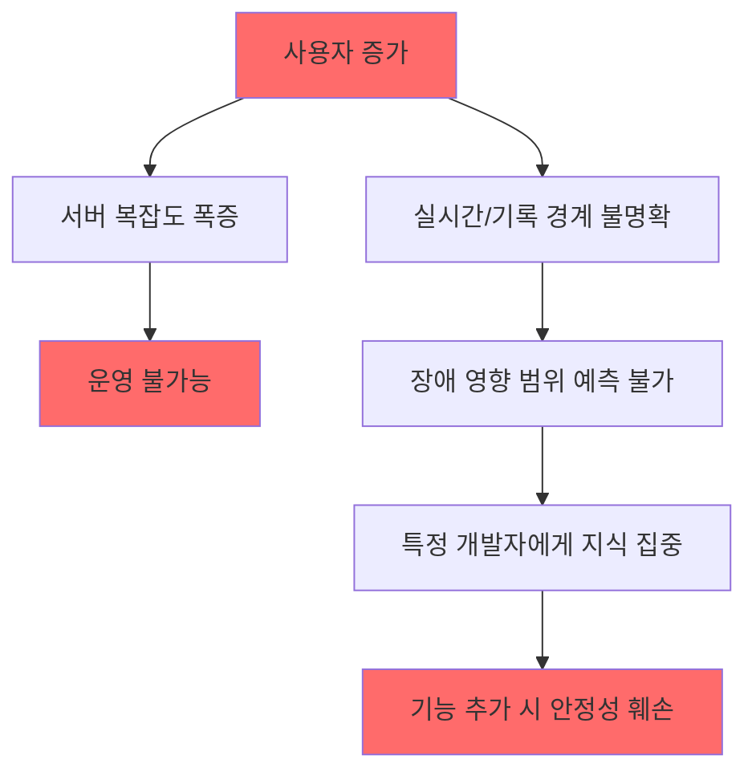

### 핵심 판단

> **문제의 핵심은 기술 부족이 아니라 구조 부재입니다.**

이 포트폴리오는 위 문제를 **구조적으로 해결**하는 과정을 보여줍니다.

-----

## 🏗️ 3가지 핵심 설계 결정

### 1️⃣ 실시간 판정과 기록의 완전한 분리

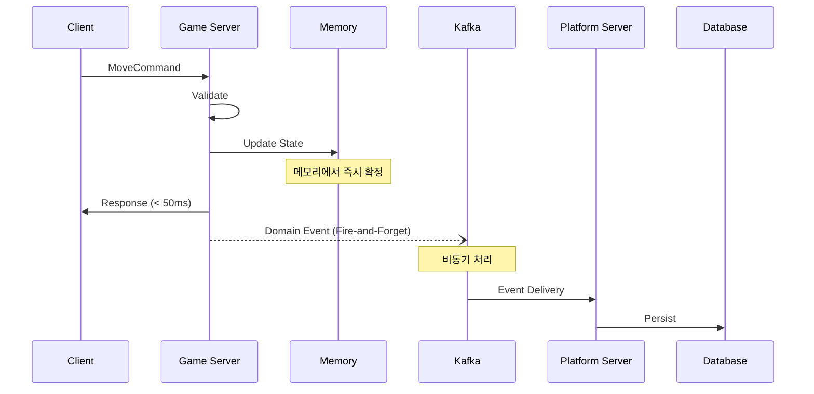

**판단 근거**:

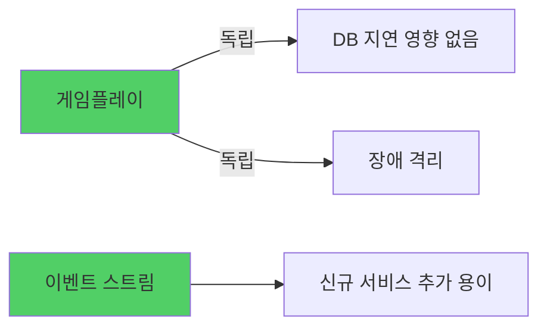

**실무 시나리오**:

```
Kafka 다운 발생:
❌ 잘못된 설계: 게임 서버도 멈춤
✅ 이 설계: 게임은 계속, 이벤트는 메모리 버퍼링
```

-----

### 2️⃣ Server-authoritative 구조

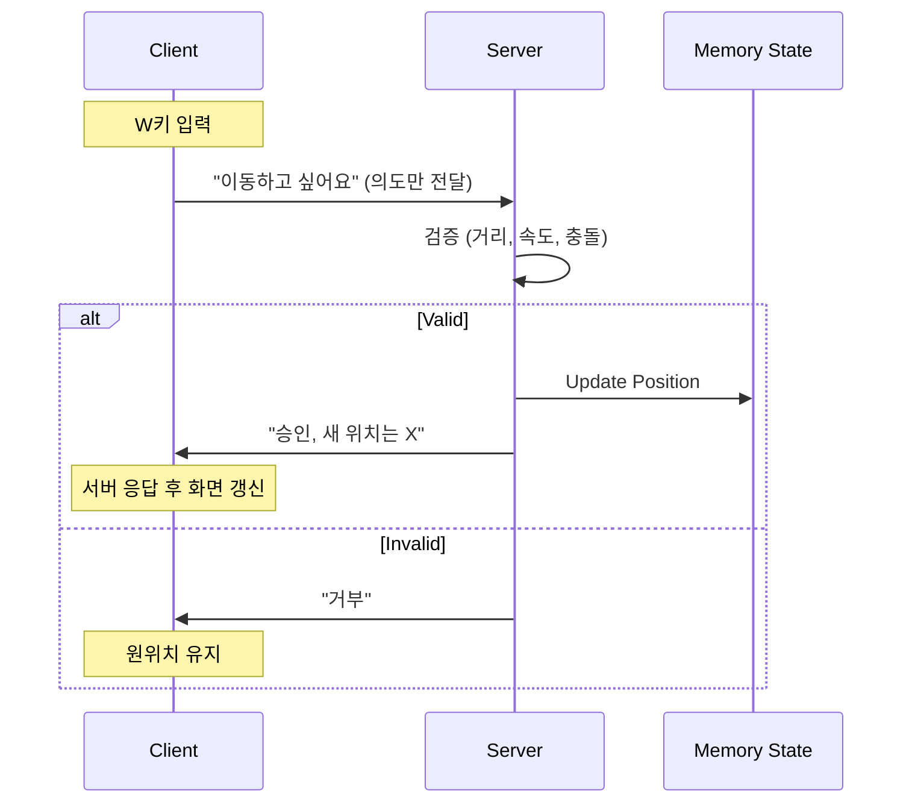

**판단 근거**:

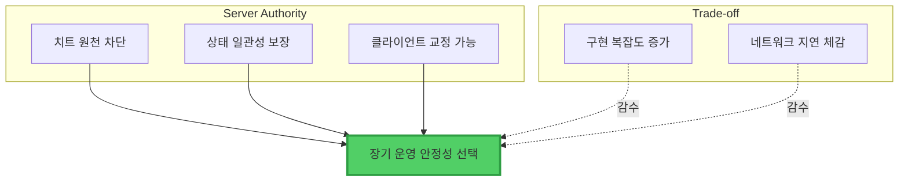

**결론**: 복잡해서가 아니라 안정성을 위해 선택

-----

### 3️⃣ 의도적으로 선택하지 않은 것들

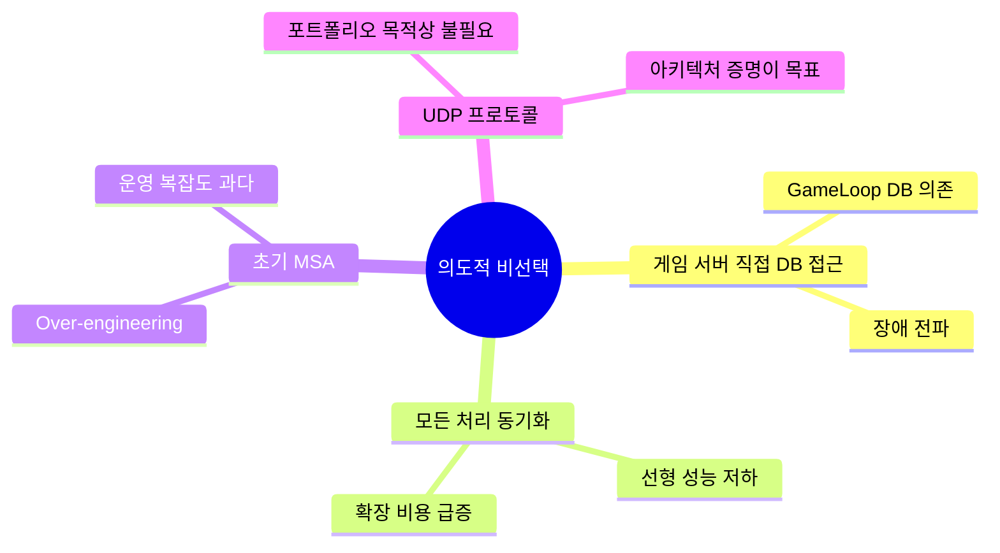

**핵심 원칙**:

> **“지금 필요하지 않으면, 지금 만들지 않는다”**

-----

## 📊 시스템 아키텍처

### 전체 구성도

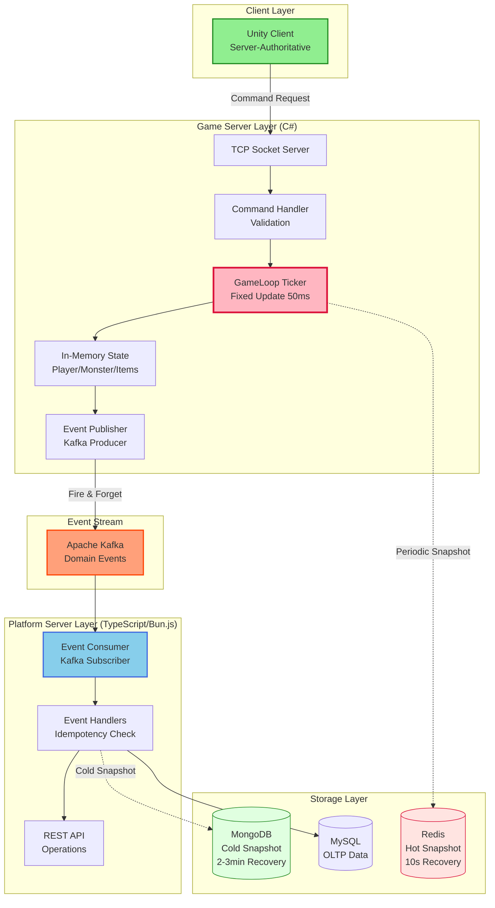

### 핵심 패턴: Command vs Event

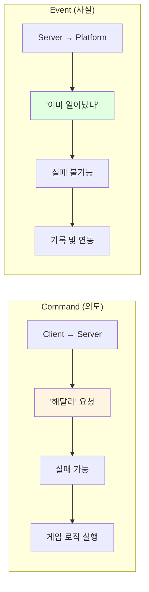

|구분    |Command        |Domain Event     |
|------|---------------|-----------------|
|**의미**|“해달라” (요청)     |“이미 일어났다” (사실)   |
|**시점**|미래             |과거               |
|**실패**|가능             |불가능 (이미 발생)      |
|**흐름**|Client → Server|Server → Platform|
|**용도**|게임 로직 실행       |기록 및 연동          |

-----

## 🛡️ 장애 대응 설계

### 장애 영향도 매트릭스

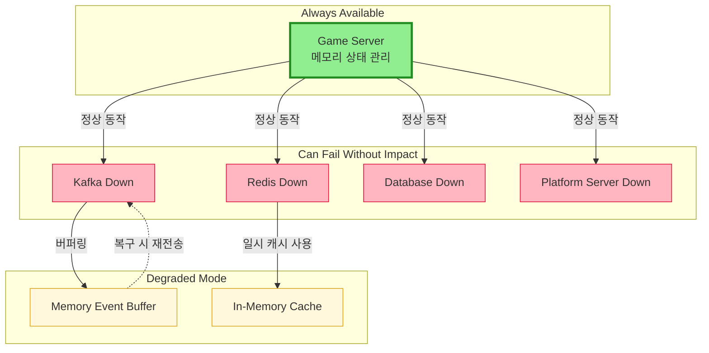

**설계 철학**:

> “게임플레이는 어떤 백엔드 장애에도 멈추지 않는다”

### 복구 전략

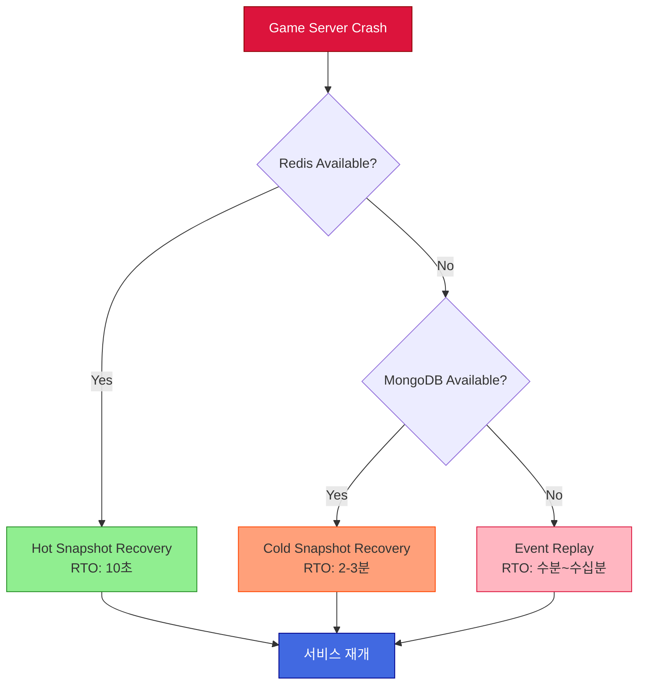

-----

## 🔄 핵심 흐름: Command → Event

### 플레이어 이동 시나리오

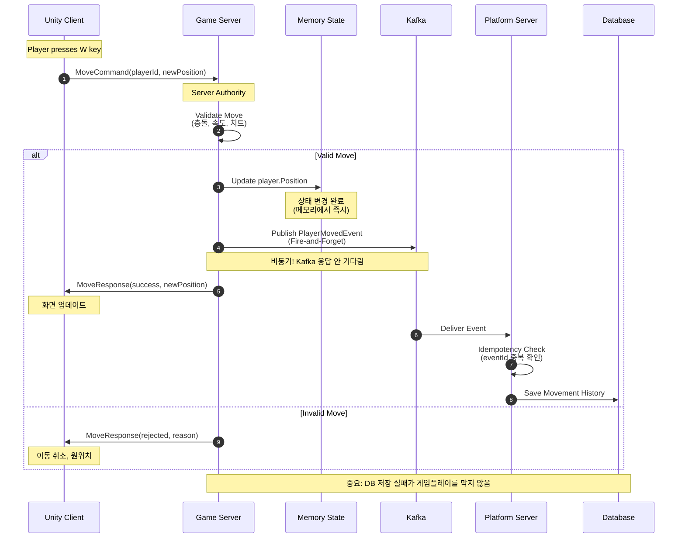

**핵심 포인트**:

1. 게임 서버는 Kafka 응답을 기다리지 않음
1. 상태는 메모리에서 이미 확정됨
1. 기록 실패가 게임플레이를 막지 않음

-----

## 📈 확장 시나리오

### Zone 기반 수평 확장

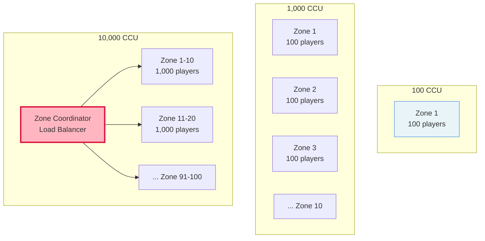

### B2B 비즈니스 모델 확장

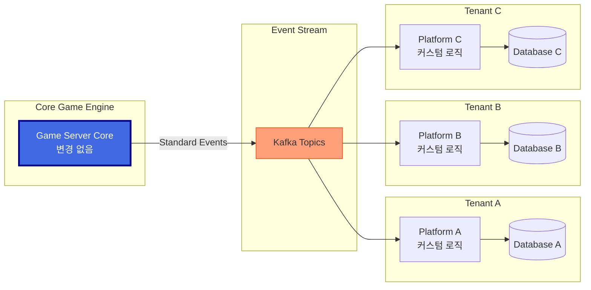

**핵심**: 게임 서버 코드 수정 없이 확장 가능

-----

## 🛠️ 기술 스택

### 게임 서버 (C#)

- **언어**: C# .NET 8.0
- **프로토콜**: TCP/IP
- **직렬화**: MessagePack
- **패턴**: Command Pattern, Event Sourcing
- **캐시**: Redis (Hot Snapshot)
- **이벤트**: Kafka Producer

### 플랫폼 서버 (TypeScript)

- **런타임**: Bun.js
- **프레임워크**: ElysiaJS
- **ORM**: Drizzle
- **DB**: MySQL (정형), MongoDB (비정형)
- **이벤트**: Kafka Consumer

### 클라이언트 (Unity)

- **엔진**: Unity 2022.3 LTS
- **구조**: Server-authoritative
- **프로토콜**: TCP Socket

-----

## 📚 상세 문서

|문서                                        |설명               |대상 독자      |
|------------------------------------------|-----------------|-----------|
|[아키텍처 상세](docs/architecture-detail.md)    |전체 시스템 구조 및 설계 원칙|백엔드 엔지니어   |
|[설계 결정 과정](docs/design-decisions.md)      |왜 이렇게 설계했는가      |테크 리드, CTO |
|[운영 가이드](docs/operational-guide.md)       |장애 대응 및 모니터링     |DevOps, SRE|
|[구현 로드맵](docs/implementation-roadmap.md) ⭐|단계별 구현 계획        |개발자, PM    |

-----

## 🗺️ 구현 로드맵

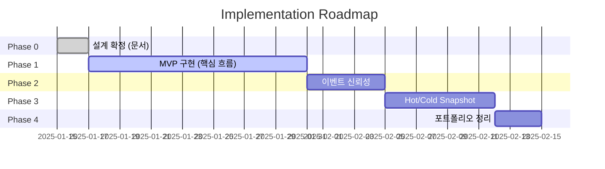

**예상 완료 기간**: 3~4주 (Phase 1 MVP까지는 1~2주)

### MVP 범위

**포함**:

- ✅ TCP 게임 서버 (C#)
- ✅ Command → Domain → Event 흐름
- ✅ Kafka Producer/Consumer
- ✅ 간단한 상태 변경 (이동)
- ✅ TypeScript 플랫폼 서버
- ✅ Unity 테스트 클라이언트

**의도적으로 제외**:

- ❌ 전투 시스템
- ❌ 복잡한 게임 콘텐츠
- ❌ 완전한 매치메이킹
- ❌ 운영 대시보드 (Phase 4에서 구현)

**왜 여기서 멈췄는가?**

> “더 만들 수 있다”가 아니라 **“언제 멈춰야 하는지 안다”**를 증명하기 위해

-----

## 💡 설계 철학

### 배운 교훈

**기술적 교훈**:

1. **복잡도는 비용이다**

- “할 수 있다”와 “해야 한다”는 다름
- 복잡한 구조는 반드시 그만한 가치를 제공해야 함

1. **장애는 언제나 발생한다**

- 장애를 막는 것보다 격리하는 것이 현실적
- “장애 시 어떻게 되는가”가 설계의 핵심

1. **확장은 선형적이어야 한다**

- 사용자 2배 → 비용 2배가 이상적
- 비선형 확장은 지속 불가능

**조직 관점 교훈**:

1. **문서화는 필수다**

- 개인의 지식은 조직에 남지 않음
- 구조를 설명할 수 없으면 좋은 구조가 아님

1. **운영 가능성이 구현보다 중요하다**

- 만들 수 있어도 운영할 수 없으면 의미 없음
- 운영팀이 이해할 수 있는 구조여야 함

1. **인수인계 가능한 시스템**

- 특정 개발자에게 의존하는 구조는 위험
- 시스템 자체가 설명할 수 있어야 함

-----

## 🔗 관련 포트폴리오

### 🎨 [Coin Data API — Platform Server in Practice](https://github.com/1985jwlee/portpolio_coindataapi)

**동일한 원칙의 비게임 도메인 적용 사례**

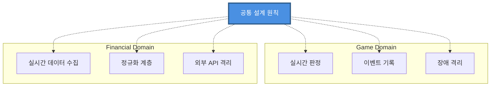

|원칙        |게임 서버 (본 프로젝트)    |Coin API                      |
|----------|------------------|------------------------------|
|**외부 격리** |DB 장애 시 게임 진행     |거래소 API 장애 시 제한 제공            |
|**정규화 계층**|Event → DB Schema |External API → Internal Schema|
|**계약 안정성**|운영 API 불변         |클라이언트 API 불변                  |
|**비동기 처리**|Kafka Event Stream|WebSocket Stream              |


> **핵심 메시지**: “설계 원칙은 도메인을 넘어 일반화 가능합니다”

-----

## 📧 Contact

**GitHub**: [@1985jwlee](https://github.com/1985jwlee)  
**Email**: leejae.w.jl@icloud.com

-----

## 📝 License

이 문서는 설계 포트폴리오로, 학습 및 평가 목적으로 공개되었습니다.

-----

## 🎓 최종 메시지

이 포트폴리오는 **코드를 작성하는 능력**이 아니라  
**시스템을 설계하고 판단하는 능력**을 증명합니다.

### 증명된 것:

✅ 실시간 시스템의 구조적 설계 능력  
✅ 장애를 격리하고 복구하는 전략  
✅ 확장 가능한 아키텍처 설계  
✅ 운영 가능성까지 고려한 시스템 설계  
✅ 조직에 남는 시스템을 만드는 사고방식

### 검증 방법:

- 📖 [설계 결정 과정](docs/design-decisions.md): 모든 판단의 근거 명시
- 🔧 [운영 가이드](docs/operational-guide.md): 장애 시나리오별 대응 방안
- 📈 [아키텍처 상세](docs/architecture-detail.md): 10배 성장 대응 전략
- 🚀 [구현 로드맵](docs/implementation-roadmap.md): 실제 구현 가능성 증명

-----

**Last Updated**: 2025-01-28

**Note**: 이 포트폴리오는 실제 게임 출시를 목적으로 하지 않으며,  
**시스템 설계 판단력과 아키텍처 사고**를 증명하기 위한 자료입니다.​​​​​​​​​​​​​​​​