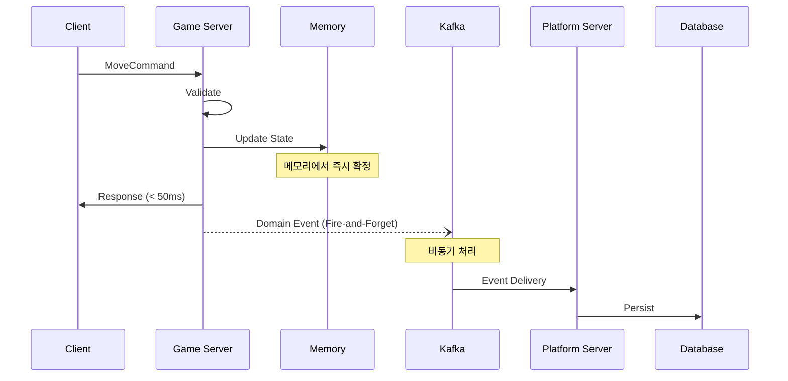
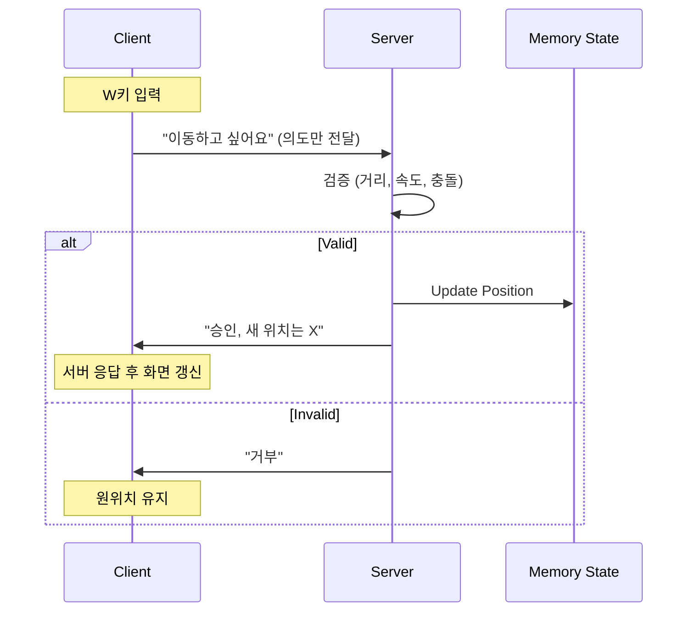
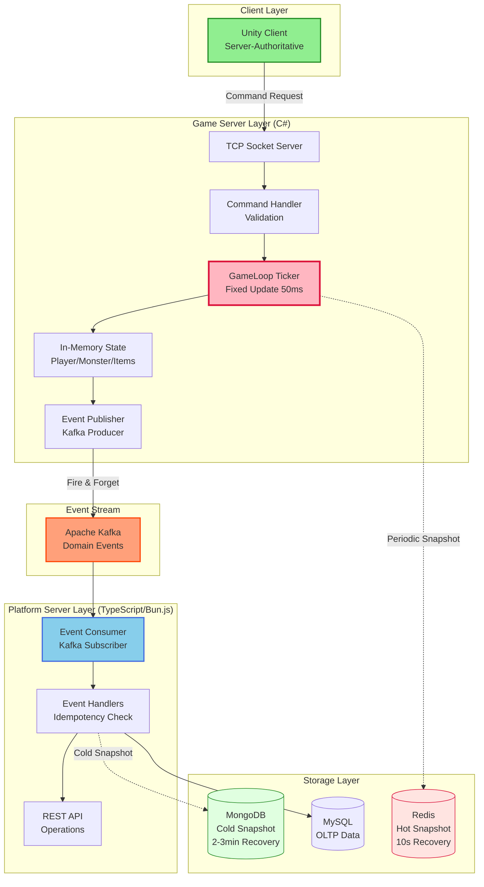
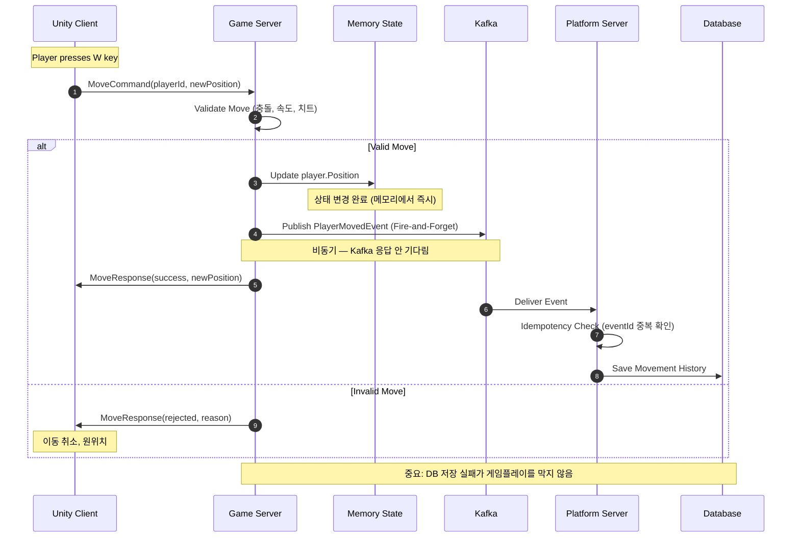

# Event-driven Real-time Game Platform Architecture

> **실시간 판정은 메모리에서 끝나고, 기록과 복구는 비동기로 흡수되는 구조**

[](docs/architecture-detail.md)
[](docs/implementation-roadmap.md)
[](LICENSE)

---

## 📌 Executive Summary

**이 포트폴리오가 증명하는 것:**

```
✓ 실시간 시스템에서의 책임 분리 설계 능력
✓ Server-authoritative 구조에 대한 깊은 이해
✓ 이벤트 기반 아키텍처의 실무적 적용
✓ 장애, 복구, 운영까지 고려한 시스템 설계
✓ 개인이 아닌 조직에 남는 시스템을 만드는 관점
```

**대상 독자**: CTO, 테크 리드, 시니어 백엔드/서버 엔지니어

> "코드를 작성하는 능력이 아니라, 시스템을 설계하고 판단하는 능력을 보여줍니다."

---

## 🏗️ 3가지 핵심 설계 결정

### 1️⃣ 실시간 판정과 기록의 완전한 분리



**실무 시나리오:**

```
Kafka 다운 발생:
❌ 잘못된 설계: 게임 서버도 멈춤
✅ 이 설계: 게임은 계속, 이벤트는 메모리 버퍼링 → 복구 후 재전송
```

---

### 2️⃣ Server-authoritative 구조



**결론**: 복잡해서가 아니라 안정성을 위해 선택. 클라이언트에 권한을 주는 순간 메모리 해킹, 동기화 불일치, 신뢰성 상실이 구조적으로 발생합니다.

---

### 3️⃣ 의도적으로 선택하지 않은 것들

| 비선택 | 이유 |
|--------|------|
| 게임 서버 직접 DB 접근 | GameLoop이 DB 응답을 기다리면 장애 전파 |
| 모든 처리 동기화 | 사용자 증가 시 선형적으로 느려짐 |
| 초기 MSA | Over-engineering, 운영 복잡도 과다 |
| UDP 프로토콜 | 포트폴리오 목적상 아키텍처 증명이 우선 |

> **"지금 필요하지 않으면, 지금 만들지 않는다"**

---

## 📊 시스템 아키텍처

### 전체 구성도



### Command vs Event

| 구분 | Command | Domain Event |
|------|---------|--------------|
| **의미** | "해달라" (요청) | "이미 일어났다" (사실) |
| **시점** | 미래 | 과거 |
| **실패** | 가능 | 불가능 (이미 발생) |
| **흐름** | Client → Server | Server → Platform |
| **용도** | 게임 로직 실행 | 기록 및 연동 |

---

## 🛡️ 장애 대응 설계

### 장애 영향도 매트릭스

| 장애 대상 | 게임플레이 | 기록 | 운영 API | 복구 난이도 |
|-----------|------------|------|----------|-------------|
| 게임 서버 | 🔴 중단 | 🟡 일시 중단 | 🟢 정상 | 낮음 |
| Redis | 🟡 순간 지연 | 🟢 정상 | 🟢 정상 | 낮음 |
| MongoDB | 🟢 정상 | 🟢 정상 | 🟢 정상 | 낮음 |
| Kafka | 🟢 정상 | 🟡 일시 중단 | 🟢 정상 | 중간 |
| MySQL | 🟢 정상 | 🟡 일시 중단 | 🔴 일부 실패 | 중간 |
| 플랫폼 서버 | 🟢 정상 | 🟡 일시 중단 | 🔴 중단 | 낮음 |

> **설계 철학**: "게임플레이는 어떤 백엔드 장애에도 멈추지 않는다"

### 복구 우선순위

```
1순위: Redis Hot Snapshot  → RTO 10초
    ↓ 실패 시
2순위: MongoDB Cold Snapshot → RTO 2~3분
    ↓ 실패 시
3순위: 초기 상태 + Kafka Event Replay → RTO 수분~수십분
```

---

## 🔄 핵심 흐름: Command → Event (플레이어 이동)



**핵심 포인트:**
1. 게임 서버는 Kafka 응답을 기다리지 않음
2. 상태는 메모리에서 이미 확정됨
3. 기록 실패가 게임플레이를 막지 않음

---

## 📈 확장 시나리오

### Zone 기반 수평 확장

| CCU 규모 | 구조 |
|----------|------|
| 100 | Zone 1 (단일) |
| 1,000 | Zone 1~10 (각 100명) |
| 10,000 | Zone Coordinator → Zone 1~100 (각 100명) |

### B2B 비즈니스 모델 확장

게임 서버 코드 수정 없이 Kafka Topic을 구독하는 Tenant를 추가하면 확장됩니다.

```
Core Game Server → Kafka Topics → Tenant A (Custom Platform + DB)
                                → Tenant B (Custom Platform + DB)
                                → Tenant C (Custom Platform + DB)
```

---

## 🛠️ 기술 스택

| 영역 | 기술 |
|------|------|
| 게임 서버 | C# .NET 8.0, TCP/IP, MessagePack |
| 플랫폼 서버 | TypeScript, Bun.js, ElysiaJS, Drizzle ORM |
| 이벤트 스트림 | Apache Kafka |
| 저장소 | Redis (Hot Snapshot), MongoDB (Cold Snapshot), MySQL (영속) |
| 클라이언트 | Unity 2022.3 LTS |

---

## 📚 상세 문서

| 문서 | 설명 | 대상 독자 |
|------|------|-----------|
| [아키텍처 상세](docs/architecture-detail.md) | 전체 시스템 구조 및 설계 원칙 | 백엔드 엔지니어 |
| [설계 결정 과정](docs/design-decisions.md) | 왜 이렇게 설계했는가 | 테크 리드, CTO |
| [운영 가이드](docs/operational-guide.md) | 장애 대응 및 모니터링 | DevOps, SRE |
| [구현 로드맵](docs/implementation-roadmap.md) ⭐ | 단계별 구현 계획 | 개발자, PM |
| [기술 스택 가이드](docs/tech-stack-guide.md) | 언어별 구현 코드 참조 | 개발자 |
| [다이어그램](docs/diagrams.md) | Mermaid 다이어그램 전체 | 프레젠테이션용 |

---

## 🗺️ 구현 로드맵

```
Phase 0. 설계 확정 (문서)         ✅ 완료
Phase 1. MVP 구현 (핵심 흐름)     🔄 진행 예정  (1~2주)
Phase 2. 이벤트 신뢰성            📋 계획       (3~5일)
Phase 3. Hot/Cold Snapshot       📋 계획       (4~7일)
Phase 4. Admin Dashboard         📋 계획       (3~5일)
```

**총 예상 기간**: 약 3~4주

### MVP 범위

**포함**: TCP 게임 서버, Command → Domain → Event 흐름, Kafka Producer/Consumer, 간단한 상태 변경, TypeScript 플랫폼 서버, Unity 테스트 클라이언트

**의도적 제외**: 전투 시스템, 복잡한 콘텐츠, 완전한 매치메이킹, 운영 대시보드 (Phase 4)

> "더 만들 수 있다"가 아니라 **"언제 멈추어야 하는지 안다"**를 증명하기 위해

---

## 🔗 관련 포트폴리오

| 프로젝트 | 연결 포인트 |
|----------|------------|
| [Coin Data API](https://github.com/1985jwlee/portpolio_coindataapi) | 동일 원칙의 비게임 도메인 적용 (외부 격리, 정규화 계층) |
| [Smart Road IoT](https://github.com/1985jwlee/production-iot-backend) | 프로덕션 환경에서의 실무 적용 (Adapter, Semaphore, WebSocket 안정성) |

> **핵심 메시지**: "설계 원칙은 도메인을 넘어 일반화 가능합니다"

---

## 📧 Contact

**GitHub**: [@1985jwlee](https://github.com/1985jwlee)
**Email**: leejae.w.jl@icloud.com

---

**Last Updated**: 2025-01-28