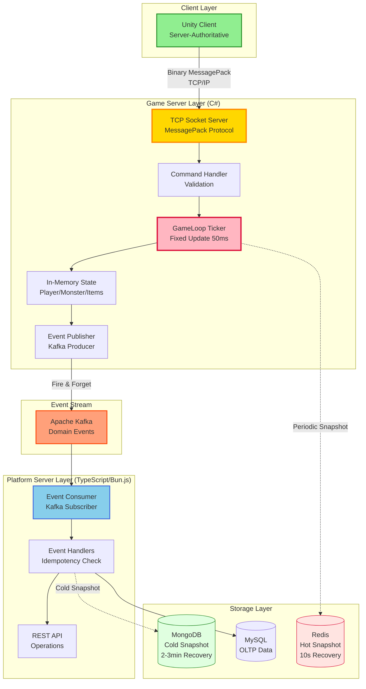
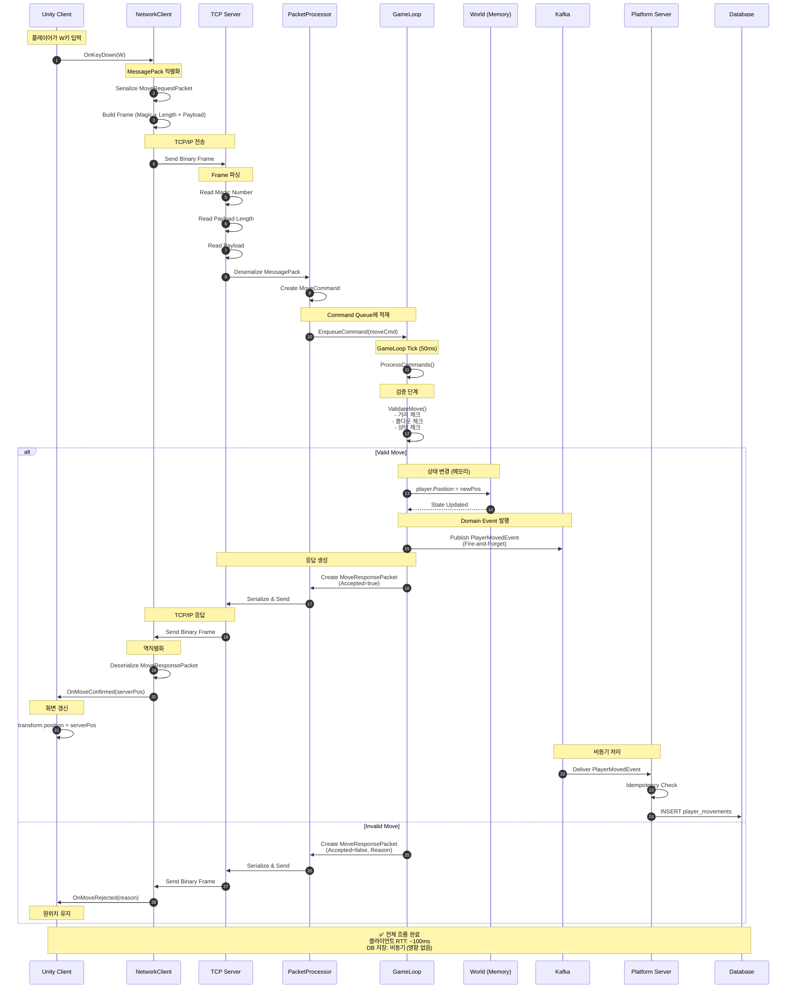
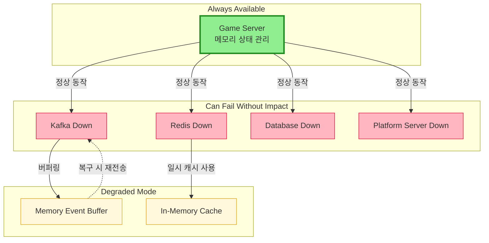
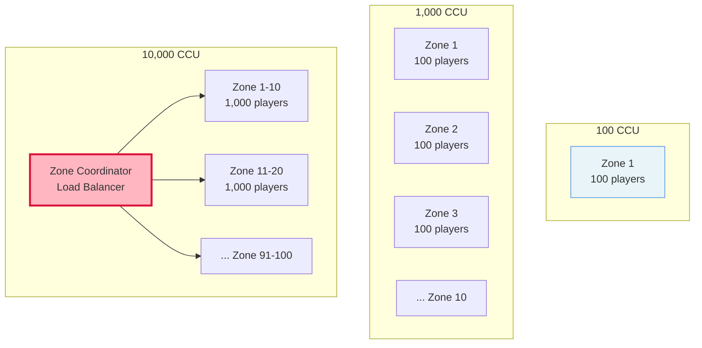

# Event-driven Real-time Game Platform Architecture

> **실시간 판정은 메모리에서 끝나고, 기록과 복구는 비동기로 흡수되는 구조**

[](docs/architecture-detail.md)
[](docs/implementation-roadmap.md)
[](LICENSE)

---

## 📌 Executive Summary

**이 포트폴리오가 증명하는 것:**

```
✓ 실시간 시스템에서의 책임 분리 설계 능력
✓ Server-authoritative 구조에 대한 깊은 이해
✓ 이벤트 기반 아키텍처의 실무적 적용
✓ 장애, 복구, 운영까지 고려한 시스템 설계
✓ 개인이 아닌 조직에 남는 시스템을 만드는 관점
✓ Binary Serialization을 활용한 효율적인 네트워크 프로토콜 설계
```

**대상 독자**: CTO, 테크 리드, 시니어 백엔드/서버 엔지니어

**핵심 메시지**: 
> "코드를 작성하는 능력이 아니라, 시스템을 설계하고 판단하는 능력을 보여줍니다."

---

## 🎯 왜 이 아키텍처인가?

### 많은 게임 서비스가 겪는 구조적 문제

```
🚨 사용자 증가 → 서버 복잡도 폭증 → 운영 불가능
🚨 실시간 처리와 기록 처리의 경계 불명확
🚨 장애 발생 시 영향 범위 예측 불가
🚨 특정 개발자에게 구조 이해가 집중됨
🚨 기능 추가 시 기존 로직 안정성 훼손
```

### 핵심 판단

> **문제의 핵심은 기술 부족이 아니라 구조 부재입니다.**

이 포트폴리오는 위 문제를 **구조적으로 해결**하는 과정을 보여줍니다.

---

## 🏗️ 3가지 핵심 설계 결정

### 1️⃣ 실시간 판정과 기록의 완전한 분리

```
[ 게임 서버 ]
  ↓ 메모리에서 즉시 판정 (< 50ms)
  ↓ Domain Event 발행 (Fire-and-Forget)
[ Kafka ]
  ↓ 비동기 처리
[ 플랫폼 서버 ]
  ↓ DB 저장, 통계, 운영
```

**판단 근거**:
- ✅ 게임플레이는 DB 지연의 영향을 받지 않음
- ✅ 장애 격리: Kafka/DB 다운 시에도 게임 진행
- ✅ 확장성: 이벤트 스트림으로 신규 서비스 추가 가능

**실무 시나리오**:
```
Kafka 다운 발생:
❌ 잘못된 설계: 게임 서버도 멈춤
✅ 이 설계: 게임은 계속, 이벤트는 메모리 버퍼링
```

---

### 2️⃣ Server-authoritative 구조

```
클라이언트: "W키를 눌렀어요" (의도만 전달)
    ↓
서버: 검증 → 승인 → 상태 변경 → 응답
    ↓
클라이언트: 서버 응답을 받아야만 화면 갱신
```

**판단 근거**:
- ✅ 치트 방지는 구조적으로 해결
- ✅ 클라이언트는 언제든 서버 기준으로 교정 가능
- ✅ 복잡해서가 아니라 안정성을 위해 선택

**트레이드오프**:
```
Client-authoritative:
- 장점: 빠른 반응성, 구현 단순
- 단점: 치트 가능, 동기화 복잡

Server-authoritative:
- 장점: 치트 원천 차단, 상태 일관성 보장
- 단점: 네트워크 지연 체감, 구현 복잡
```

**결론**: 장기 운영 안정성을 위해 Server-authoritative 선택

---

### 3️⃣ 의도적으로 선택하지 않은 것들

```
❌ 게임 서버 직접 DB 접근
   → GameLoop이 DB에 의존하게 됨
   
❌ 모든 처리를 동기로
   → 사용자 증가 시 선형적 성능 저하
   
❌ 초기부터 마이크로서비스
   → 운영 복잡도 대비 얻는 가치 부족
   
❌ UDP 프로토콜
   → 포트폴리오 목적상 TCP로 충분
```

**핵심 원칙**: 
> **"지금 필요하지 않으면, 지금 만들지 않는다"**

---

## 📊 시스템 아키텍처

### 전체 구성도



---

## 🔌 Unity ↔ Game Server 통신 프로토콜

### MessagePack 기반 Binary Serialization

**선택 이유**:
```
✓ JSON 대비 2~5배 작은 패킷 크기
✓ 직렬화/역직렬화 성능 우수 (네이티브 수준)
✓ C#과 TypeScript 양쪽 모두 지원
✓ 스키마 정의로 타입 안정성 확보
✓ 실시간 게임에 최적화된 바이너리 포맷
```

### 패킷 구조 설계

#### 공통 패킷 헤더

```csharp
[MessagePackObject]
public class PacketHeader
{
    [Key(0)]
    public ushort PacketId { get; set; }        // 패킷 식별자
    
    [Key(1)]
    public uint Sequence { get; set; }          // 시퀀스 번호
    
    [Key(2)]
    public long Timestamp { get; set; }         // 타임스탬프 (Unix ms)
    
    [Key(3)]
    public ushort PayloadLength { get; set; }   // 페이로드 길이
}
```

#### Request/Response 패킷

```csharp
// 클라이언트 → 서버
[MessagePackObject]
public class MoveRequestPacket
{
    [Key(0)]
    public PacketHeader Header { get; set; }
    
    [Key(1)]
    public string PlayerId { get; set; }
    
    [Key(2)]
    public Vector3Data NewPosition { get; set; }
    
    [Key(3)]
    public float ClientTimestamp { get; set; }  // 지연 보상용
}

// 서버 → 클라이언트
[MessagePackObject]
public class MoveResponsePacket
{
    [Key(0)]
    public PacketHeader Header { get; set; }
    
    [Key(1)]
    public bool Accepted { get; set; }
    
    [Key(2)]
    public Vector3Data ServerPosition { get; set; }
    
    [Key(3)]
    public string RejectReason { get; set; }    // 거부 사유
    
    [Key(4)]
    public float ServerTimestamp { get; set; }
}
```

#### 커스텀 타입 직렬화

```csharp
// Unity Vector3를 MessagePack으로 직렬화
[MessagePackObject]
public struct Vector3Data
{
    [Key(0)]
    public float X { get; set; }
    
    [Key(1)]
    public float Y { get; set; }
    
    [Key(2)]
    public float Z { get; set; }
    
    public static implicit operator Vector3Data(Vector3 v)
        => new Vector3Data { X = v.x, Y = v.y, Z = v.z };
    
    public static implicit operator Vector3(Vector3Data v)
        => new Vector3(v.X, v.Y, v.Z);
}
```

### TCP 프레임 프로토콜

```
┌─────────────────────────────────────────────────┐
│ Frame Header (6 bytes)                          │
├─────────────────────────────────────────────────┤
│ Magic Number (2 bytes): 0xABCD                  │
│ Payload Length (4 bytes): uint32                │
├─────────────────────────────────────────────────┤
│ MessagePack Payload (variable)                  │
├─────────────────────────────────────────────────┤
│ Checksum (4 bytes): CRC32 (optional)            │
└─────────────────────────────────────────────────┘
```

**프레임 처리 로직**:

```csharp
// 서버측 수신
public class FrameReader
{
    private const ushort MAGIC_NUMBER = 0xABCD;
    private byte[] _buffer = new byte[8192];
    private int _bufferOffset = 0;
    
    public async Task<byte[]> ReadFrameAsync(NetworkStream stream)
    {
        // 1. Magic Number 읽기
        await stream.ReadAsync(_buffer, 0, 2);
        var magic = BitConverter.ToUInt16(_buffer, 0);
        
        if (magic != MAGIC_NUMBER)
            throw new InvalidDataException("Invalid magic number");
        
        // 2. Payload Length 읽기
        await stream.ReadAsync(_buffer, 0, 4);
        var length = BitConverter.ToUInt32(_buffer, 0);
        
        if (length > 1_048_576) // 1MB 제한
            throw new InvalidDataException("Payload too large");
        
        // 3. Payload 읽기
        var payload = new byte[length];
        var totalRead = 0;
        
        while (totalRead < length)
        {
            var read = await stream.ReadAsync(
                payload, 
                totalRead, 
                (int)length - totalRead
            );
            
            if (read == 0)
                throw new EndOfStreamException();
            
            totalRead += read;
        }
        
        return payload;
    }
}
```

### Unity 클라이언트 구현

```csharp
using System;
using System.Net.Sockets;
using UnityEngine;
using MessagePack;

public class NetworkClient : MonoBehaviour
{
    private TcpClient _client;
    private NetworkStream _stream;
    private uint _sequence = 0;
    
    public async void SendMoveRequest(Vector3 newPosition)
    {
        var packet = new MoveRequestPacket
        {
            Header = new PacketHeader
            {
                PacketId = 1001,
                Sequence = _sequence++,
                Timestamp = DateTimeOffset.UtcNow.ToUnixTimeMilliseconds()
            },
            PlayerId = PlayerPrefs.GetString("PlayerId"),
            NewPosition = newPosition,
            ClientTimestamp = Time.time
        };
        
        // MessagePack 직렬화
        var payload = MessagePackSerializer.Serialize(packet);
        
        // Frame 구성
        var frame = BuildFrame(payload);
        
        // 전송
        await _stream.WriteAsync(frame, 0, frame.Length);
        
        Debug.Log($"[Network] Sent: MoveRequest seq={packet.Header.Sequence}");
    }
    
    private byte[] BuildFrame(byte[] payload)
    {
        var frame = new byte[6 + payload.Length];
        
        // Magic Number
        BitConverter.GetBytes((ushort)0xABCD).CopyTo(frame, 0);
        
        // Payload Length
        BitConverter.GetBytes((uint)payload.Length).CopyTo(frame, 2);
        
        // Payload
        payload.CopyTo(frame, 6);
        
        return frame;
    }
    
    private async void ReceiveLoop()
    {
        var frameReader = new FrameReader();
        
        while (true)
        {
            try
            {
                var payload = await frameReader.ReadFrameAsync(_stream);
                ProcessPacket(payload);
            }
            catch (Exception ex)
            {
                Debug.LogError($"[Network] Receive error: {ex.Message}");
                break;
            }
        }
    }
    
    private void ProcessPacket(byte[] payload)
    {
        // MessagePack 역직렬화
        var response = MessagePackSerializer.Deserialize<MoveResponsePacket>(payload);
        
        if (response.Accepted)
        {
            // 서버가 승인한 위치로 이동
            transform.position = response.ServerPosition;
            
            var latency = Time.time - response.ServerTimestamp;
            Debug.Log($"[Network] Move accepted. Latency: {latency * 1000:F1}ms");
        }
        else
        {
            Debug.LogWarning($"[Network] Move rejected: {response.RejectReason}");
        }
    }
}
```

### 게임 서버 구현

```csharp
public class PacketProcessor
{
    public void ProcessPacket(Session session, byte[] payload)
    {
        // MessagePack 역직렬화
        var request = MessagePackSerializer.Deserialize<MoveRequestPacket>(payload);
        
        // Command 생성
        var command = new MoveCommand
        {
            PlayerId = request.PlayerId,
            NewPosition = request.NewPosition,
            ClientTimestamp = request.ClientTimestamp,
            RequestSequence = request.Header.Sequence
        };
        
        // GameLoop Queue에 적재
        GameLoop.Instance.EnqueueCommand(command);
    }
}

public class MoveCommandHandler
{
    public MoveResponsePacket Execute(MoveCommand cmd, World world)
    {
        var player = world.GetPlayer(cmd.PlayerId);
        
        // 검증
        var validation = ValidateMove(player, cmd.NewPosition);
        
        if (!validation.IsValid)
        {
            return new MoveResponsePacket
            {
                Header = new PacketHeader
                {
                    PacketId = 2001,
                    Sequence = cmd.RequestSequence,
                    Timestamp = DateTimeOffset.UtcNow.ToUnixTimeMilliseconds()
                },
                Accepted = false,
                ServerPosition = player.Position,
                RejectReason = validation.Reason,
                ServerTimestamp = Time.time
            };
        }
        
        // 상태 변경 (메모리)
        var oldPosition = player.Position;
        player.Position = cmd.NewPosition;
        
        // Domain Event 발행 (비동기)
        PublishEvent(new PlayerMovedEvent
        {
            EventId = Guid.NewGuid().ToString(),
            PlayerId = player.Id,
            FromPosition = oldPosition,
            ToPosition = cmd.NewPosition,
            OccurredAt = DateTime.UtcNow
        });
        
        // 응답
        return new MoveResponsePacket
        {
            Header = new PacketHeader
            {
                PacketId = 2001,
                Sequence = cmd.RequestSequence,
                Timestamp = DateTimeOffset.UtcNow.ToUnixTimeMilliseconds()
            },
            Accepted = true,
            ServerPosition = player.Position,
            ServerTimestamp = Time.time
        };
    }
}
```

### 성능 최적화

#### 1. 패킷 풀링

```csharp
public class PacketPool<T> where T : class, new()
{
    private readonly ConcurrentBag<T> _pool = new();
    
    public T Rent()
    {
        return _pool.TryTake(out var item) ? item : new T();
    }
    
    public void Return(T item)
    {
        // 재사용 가능한 상태로 초기화
        if (item is IResettable resettable)
            resettable.Reset();
        
        _pool.Add(item);
    }
}

// 사용
var packet = _packetPool.Rent();
try
{
    // 패킷 처리
}
finally
{
    _packetPool.Return(packet);
}
```

#### 2. Zero-Copy 직렬화

```csharp
// ArraySegment를 활용한 메모리 절약
public class ZeroCopySerializer
{
    private readonly byte[] _sharedBuffer = new byte[8192];
    
    public ArraySegment<byte> Serialize<T>(T packet)
    {
        var length = MessagePackSerializer.Serialize(
            _sharedBuffer.AsMemory(),
            packet
        );
        
        return new ArraySegment<byte>(_sharedBuffer, 0, length);
    }
}
```

### 통신 메트릭

```csharp
public class NetworkMetrics
{
    public int PacketsSent { get; set; }
    public int PacketsReceived { get; set; }
    public long BytesSent { get; set; }
    public long BytesReceived { get; set; }
    public float AverageLatency { get; set; }
    public int PacketLoss { get; set; }
    
    public void RecordSent(int bytes)
    {
        PacketsSent++;
        BytesSent += bytes;
    }
    
    public void RecordReceived(int bytes, float latency)
    {
        PacketsReceived++;
        BytesReceived += bytes;
        
        // Moving average
        AverageLatency = (AverageLatency * 0.9f) + (latency * 0.1f);
    }
}
```

---

## 🔄 핵심 흐름: Command → Event

### 플레이어 이동 시나리오 (상세)



### 코드 흐름 (완전한 예시)

```csharp
// 1. Unity 클라이언트
void Update()
{
    if (Input.GetKeyDown(KeyCode.W))
    {
        var newPos = transform.position + Vector3.forward;
        _networkClient.SendMoveRequest(newPos);  // 비동기 전송
        
        // 중요: 즉시 위치 변경하지 않음!
        // 서버 응답을 기다림
    }
}

// 2. 게임 서버 - TCP 수신
public async Task HandleClientAsync(TcpClient client)
{
    var stream = client.GetStream();
    var frameReader = new FrameReader();
    
    while (true)
    {
        var payload = await frameReader.ReadFrameAsync(stream);
        var request = MessagePackSerializer.Deserialize<MoveRequestPacket>(payload);
        
        var command = new MoveCommand
        {
            PlayerId = request.PlayerId,
            NewPosition = request.NewPosition,
            Sequence = request.Header.Sequence
        };
        
        // Command Queue에 적재 (비동기)
        GameLoop.Instance.EnqueueCommand(command);
    }
}

// 3. GameLoop - Command 처리
public void ProcessCommands()
{
    while (_commandQueue.TryDequeue(out var command))
    {
        var player = _world.GetPlayer(command.PlayerId);
        
        // 검증
        if (!ValidateMove(player, command.NewPosition))
        {
            SendRejection(command);
            continue;
        }
        
        // 상태 변경 (메모리에서 즉시)
        var oldPos = player.Position;
        player.Position = command.NewPosition;
        
        // Domain Event 발행 (Fire-and-Forget)
        _eventPublisher.PublishAsync(new PlayerMovedEvent
        {
            EventId = Guid.NewGuid().ToString(),
            PlayerId = player.Id,
            FromPosition = oldPos,
            ToPosition = command.NewPosition,
            OccurredAt = DateTime.UtcNow
        });
        
        // 클라이언트 응답 (Kafka 응답 기다리지 않음!)
        SendResponse(command, player.Position);
    }
}

// 4. Kafka Producer
public async Task PublishAsync(DomainEvent evt)
{
    try
    {
        var data = MessagePackSerializer.Serialize(evt);
        
        _ = _producer.ProduceAsync("game.events.player", new Message
        {
            Key = evt.AggregateId,
            Value = data
        });
        
        // 중요: await 하지 않음 (Fire-and-Forget)
    }
    catch (Exception ex)
    {
        // Kafka 실패 시 메모리 버퍼에 임시 저장
        _eventBuffer.Add(evt);
    }
}

// 5. 플랫폼 서버 - Event 소비
public async Task HandleEvent(PlayerMovedEvent evt)
{
    // Idempotency 검증
    var key = $"event:{evt.EventId}";
    if (await _redis.ExistsAsync(key))
    {
        return; // 이미 처리됨
    }
    
    // DB 저장
    await _db.InsertAsync(new PlayerMovement
    {
        PlayerId = evt.PlayerId,
        FromPosition = evt.FromPosition,
        ToPosition = evt.ToPosition,
        OccurredAt = evt.OccurredAt
    });
    
    // 처리 완료 기록
    await _redis.SetAsync(key, "processed", TimeSpan.FromHours(1));
}
```

**핵심 포인트**:
1. 게임 서버는 Kafka 응답을 기다리지 않음
2. 상태는 메모리에서 이미 확정됨
3. 기록 실패가 게임플레이를 막지 않음
4. MessagePack으로 네트워크 오버헤드 최소화
5. Frame 프로토콜로 패킷 경계 명확화

---

## 🛡️ 장애 대응 설계

### 장애 영향도 매트릭스



**설계 철학**: 
> "게임플레이는 어떤 백엔드 장애에도 멈추지 않는다"

---

## 📈 확장 시나리오

### Zone 기반 수평 확장



---

## 🛠️ 기술 스택

### 게임 서버 (C#)
- **언어**: C# 12 / .NET 8.0
- **프로토콜**: TCP/IP
- **직렬화**: MessagePack 2.5+
- **패턴**: Command Pattern, Event Sourcing
- **캐시**: StackExchange.Redis
- **이벤트**: Confluent.Kafka

### 플랫폼 서버 (TypeScript)
- **런타임**: bun.js 1.0+
- **프레임워크**: ElysiaJS 0.8+
- **ORM**: Drizzle ORM
- **DB**: MySQL 8.0 (정형), MongoDB 7.0 (비정형)
- **이벤트**: KafkaJS 2.2+

### 클라이언트 (Unity)
- **엔진**: Unity 2022.3 LTS
- **구조**: Server-authoritative
- **프로토콜**: TCP Socket
- **직렬화**: MessagePack for C#

### 인프라
- **메시지 큐**: Apache Kafka 3.6+
- **캐시**: Redis 7.2+
- **스토리지**: MongoDB 7.0, MySQL 8.0
- **컨테이너**: Docker / Docker Compose

---

## 📚 상세 문서

| 문서 | 설명 | 대상 독자 |
|------|------|----------|
| [아키텍처 상세](docs/architecture-detail.md) | 전체 시스템 구조 및 설계 원칙 | 백엔드 엔지니어 |
| [설계 결정 과정](docs/design-decisions.md) | 왜 이렇게 설계했는가 | 테크 리드, CTO |
| [운영 가이드](docs/operational-guide.md) | 장애 대응 및 모니터링 | DevOps, SRE |
| [구현 로드맵](docs/implementation-roadmap.md) ⭐ | 단계별 구현 계획 | 개발자, PM |
| [기술 스택 가이드](docs/tech-stack-guide.md) | 언어별 구현 예시 | 개발자 |
| [다이어그램](docs/diagrams.md) | 시스템 시각화 자료 | 모든 이해관계자 |

---

## 💡 설계 철학

### 배운 교훈

**기술적 교훈**:
1. **복잡도는 비용이다**
   - "할 수 있다"와 "해야 한다"는 다름
   - 복잡한 구조는 반드시 그만한 가치를 제공해야 함

2. **장애는 언제나 발생한다**
   - 장애를 막는 것보다 격리하는 것이 현실적
   - "장애 시 어떻게 되는가"가 설계의 핵심

3. **확장은 선형적이어야 한다**
   - 사용자 2배 → 비용 2배가 이상적
   - 비선형 확장은 지속 불가능

4. **프로토콜은 명확해야 한다**
   - Binary 직렬화로 성능 확보
   - Frame 프로토콜로 패킷 경계 명확화
   - 타입 안정성으로 버그 예방

**조직 관점 교훈**:
1. **문서화는 필수다**
   - 개인의 지식은 조직에 남지 않음
   - 구조를 설명할 수 없으면 좋은 구조가 아님

2. **운영 가능성이 구현보다 중요하다**
   - 만들 수 있어도 운영할 수 없으면 의미 없음
   - 운영팀이 이해할 수 있는 구조여야 함

3. **인수인계 가능한 시스템**
   - 특정 개발자에게 의존하는 구조는 위험
   - 시스템 자체가 설명할 수 있어야 함

---

## 🔗 관련 포트폴리오

이 설계 원칙은 다른 도메인에도 적용 가능합니다:

### 📊 [Coin Data API Platform](https://github.com/1985jwlee/portpolio_coindataapi)

**동일한 원칙의 금융/핀테크 도메인 적용 사례**

| 원칙 | 게임 서버 (본 프로젝트) | Coin API |
|------|----------------------|----------|
| **외부 격리** | DB 장애 시 게임 진행 | 거래소 API 장애 시 캐시 제공 |
| **정규화 계층** | Event → DB Schema | External API → Internal Schema |
| **계약 안정성** | 운영 API 불변 | 클라이언트 API 불변 |
| **비동기 처리** | Kafka Event Stream | WebSocket → Queue → Cache |

### 🎨 [React State Manager](https://github.com/1985jwlee/portpolio_react)

**Admin Dashboard 프로토타입**

| Main Portfolio | React Portfolio |
|----------------|-----------------|
| 서버 오브젝트 상태 관리 | UI 오브젝트 상태 관리 |
| Event Sourcing | State Management |
| Snapshot 복구 (서버) | 저장/불러오기 (클라이언트) |
| 운영 대시보드 설계 | 운영 도구 구현 |

> **핵심 메시지**: "설계 원칙은 도메인을 넘어 일반화 가능합니다"

---

## 📧 Contact

**GitHub**: [@1985jwlee](https://github.com/1985jwlee)  
**Email**: leejae.w.jl@icloud.com

> 💡 포트폴리오에 대한 질문이나 피드백은 각 저장소의 Issues를 활용해주세요.

---

## 🎓 최종 메시지

이 포트폴리오는 **코드를 작성하는 능력**이 아니라  
**시스템을 설계하고 판단하는 능력**을 증명합니다.

### 증명된 것:

✅ 실시간 시스템의 구조적 설계 능력  
✅ 장애를 격리하고 복구하는 전략  
✅ 확장 가능한 아키텍처 설계  
✅ 운영 가능성까지 고려한 시스템 설계  
✅ 조직에 남는 시스템을 만드는 사고방식  
✅ Binary 프로토콜 설계와 최적화 능력  

### 검증 방법:

- 📖 [설계 결정 과정](docs/design-decisions.md): 모든 판단의 근거 명시
- 🔧 [운영 가이드](docs/operational-guide.md): 장애 시나리오별 대응 방안
- 📈 [확장 시나리오](docs/architecture-detail.md): 10배 성장 대응 전략
- 🚀 [구현 로드맵](docs/implementation-roadmap.md): 실제 구현 가능성 증명

---

**Last Updated**: 2025-01-22  

**Note**: 이 포트폴리오는 실제 게임 출시를 목적으로 하지 않으며,  
**시스템 설계 판단력과 아키텍처 사고**를 증명하기 위한 자료입니다.
