# 시스템 아키텍처 다이어그램

[← 메인으로 돌아가기](../README.md)

---

## 📋 다이어그램 사용 가이드

### README.md에 포함할 다이어그램
1. **전체 시스템 아키텍처** - 첫인상용
2. **장애 영향도 맵** - 안정성 증명용

### 면접/프레젠테이션용
1. **Command/Event 처리 흐름** - 설계 설명용
2. **장애 복구 플로우** - 운영 관점 설명용

### 기술 문서용
1. **데이터 흐름** - 아키텍처 상세 설명용
2. **배포 아키텍처** - 확장성 설명용

---

## 📋 목차

1. [전체 시스템 아키텍처](#전체-시스템-아키텍처)
2. [Command/Event 처리 흐름](#commandevent-처리-흐름)
3. [장애 복구 플로우](#장애-복구-플로우)
4. [데이터 흐름](#데이터-흐름)
5. [배포 아키텍처](#배포-아키텍처)

---

## 전체 시스템 아키텍처

### 컴포넌트 구성도

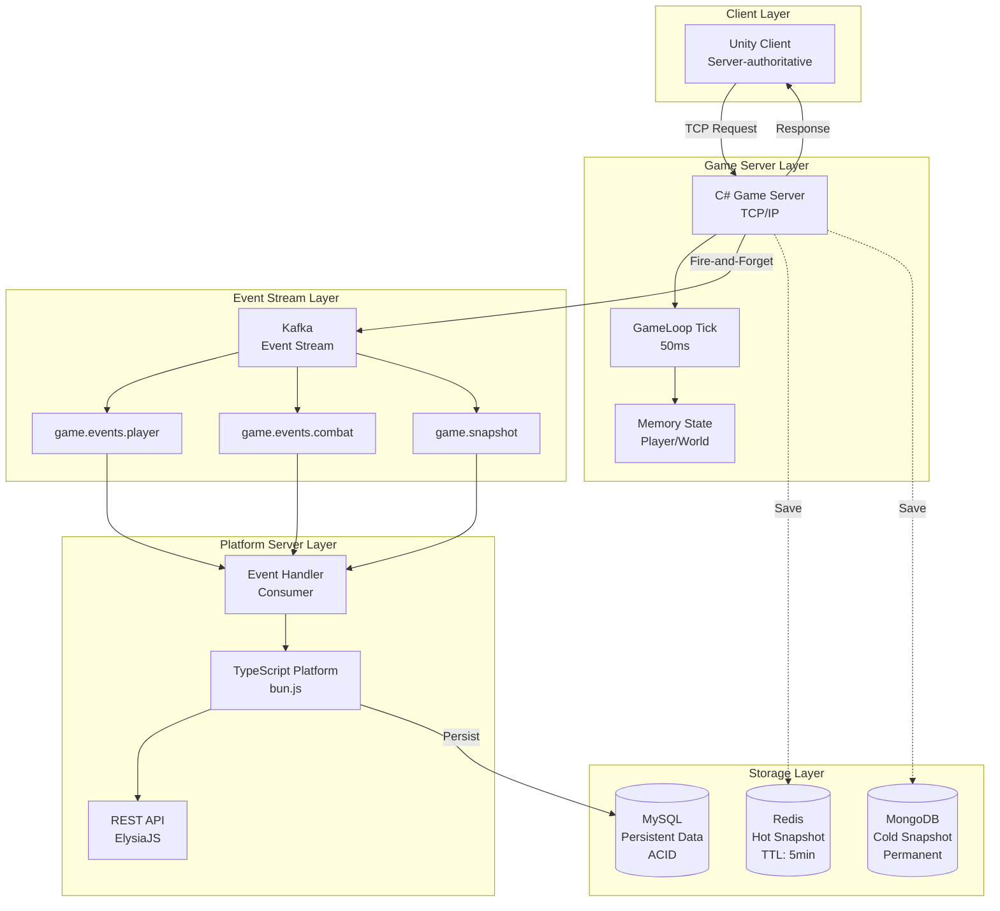

---

## Command/Event 처리 흐름

### 패킷부터 DB까지의 완전한 여정

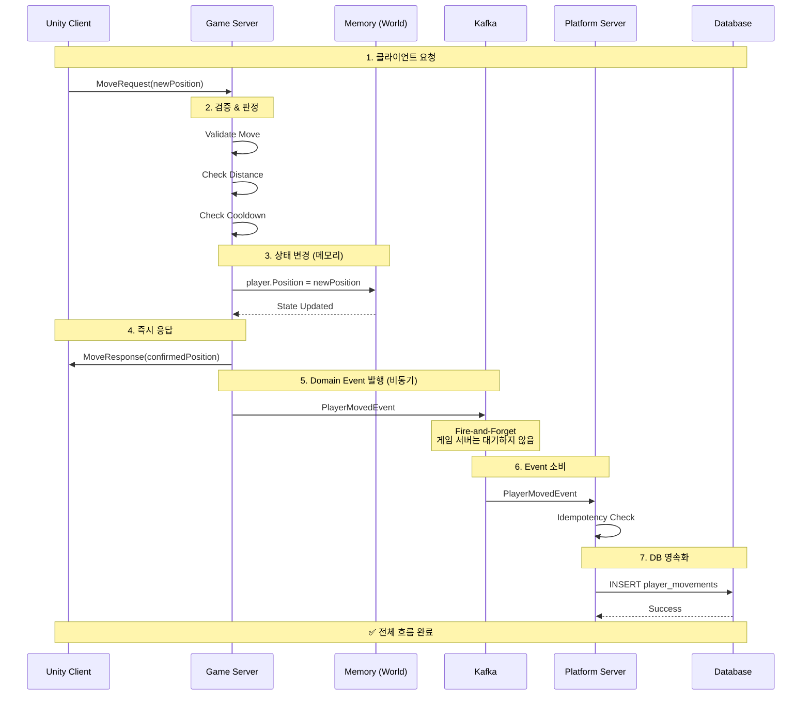

### 핵심 타이밍

```mermaid
gantt
    title 처리 타이밍 분석
    dateFormat X
    axisFormat %L ms
    
    section Client
    요청 전송    :0, 5
    응답 대기    :5, 50
    화면 갱신    :50, 60
    
    section Game Server
    패킷 수신    :5, 10
    검증        :10, 15
    상태 변경    :15, 20
    응답 전송    :20, 50
    Event 발행  :20, 25
    
    section Kafka
    Event 저장  :25, 100
    
    section Platform
    Event 소비  :100, 150
    DB 저장     :150, 250
```

---

## 장애 복구 플로우

### 게임 서버 크래시 복구 시나리오

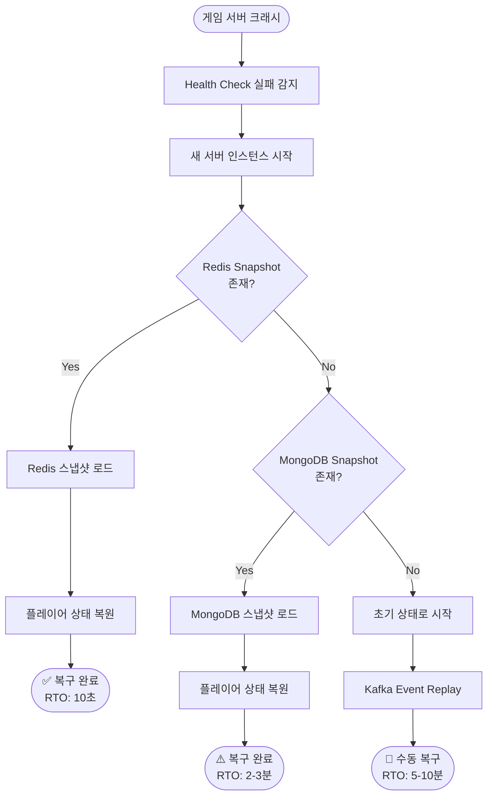

### 장애 영향도 맵

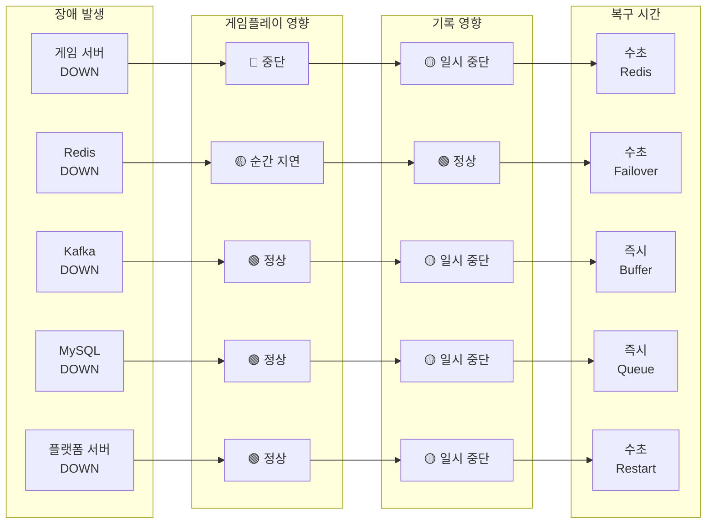

---

## 데이터 흐름

### 실시간 데이터 vs 영속 데이터

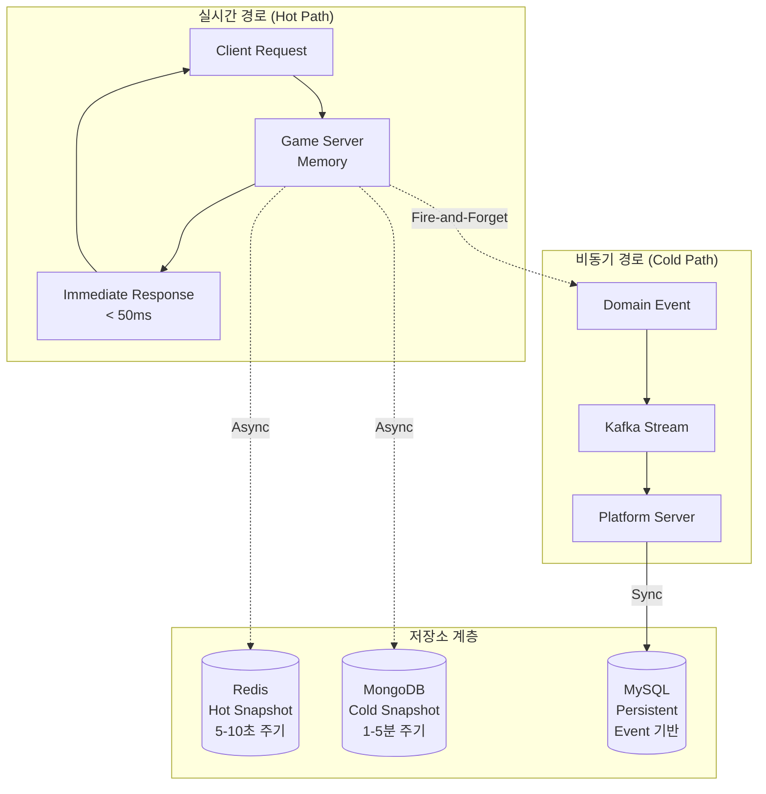

### 스냅샷 저장 전략

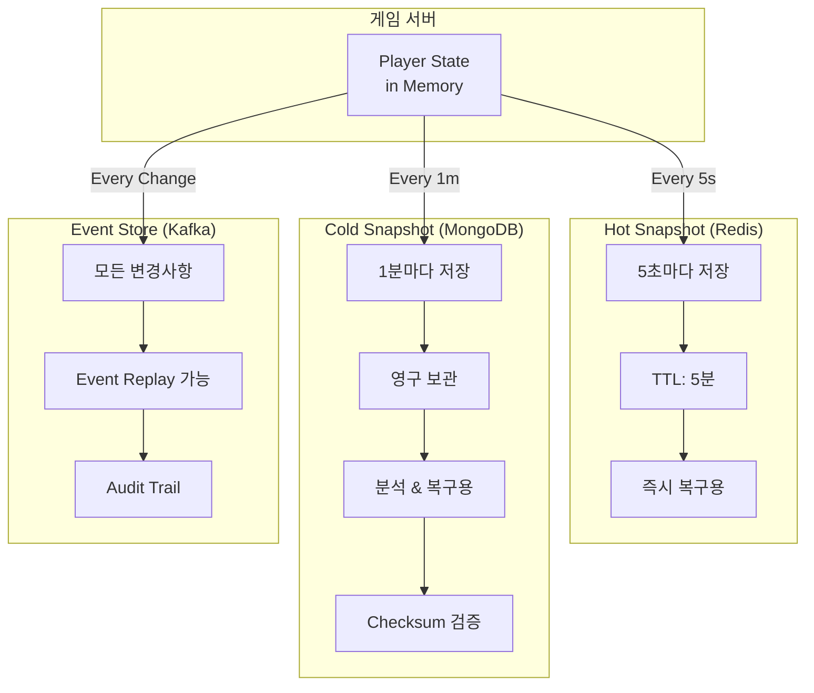

---

## 배포 아키텍처

### Zone 기반 수평 확장

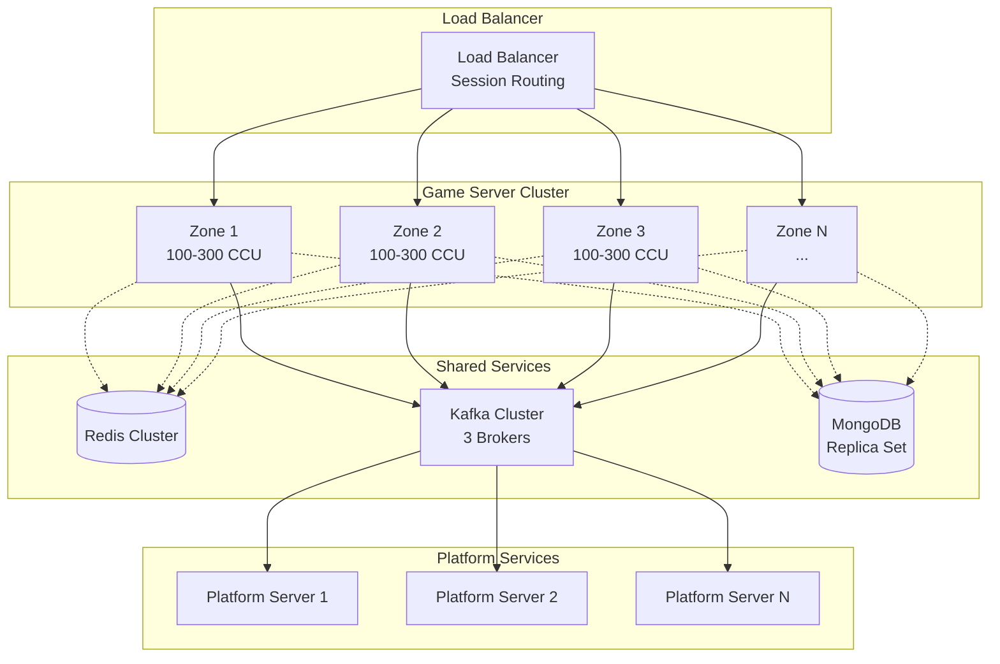

### 무중단 배포 (Rolling Update)

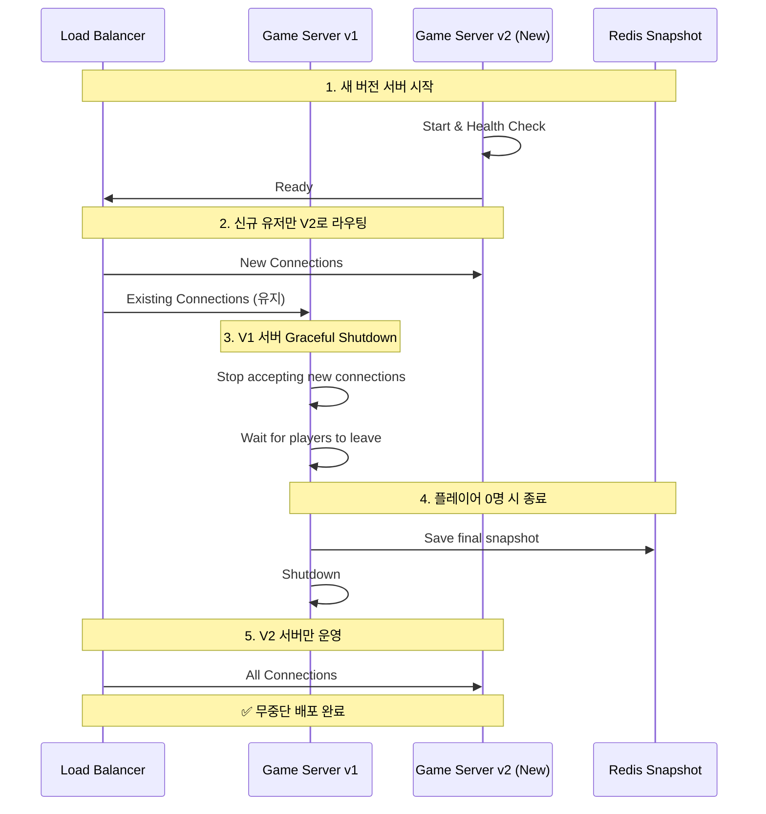

---

## 확장 시나리오

### CCU 증가에 따른 확장

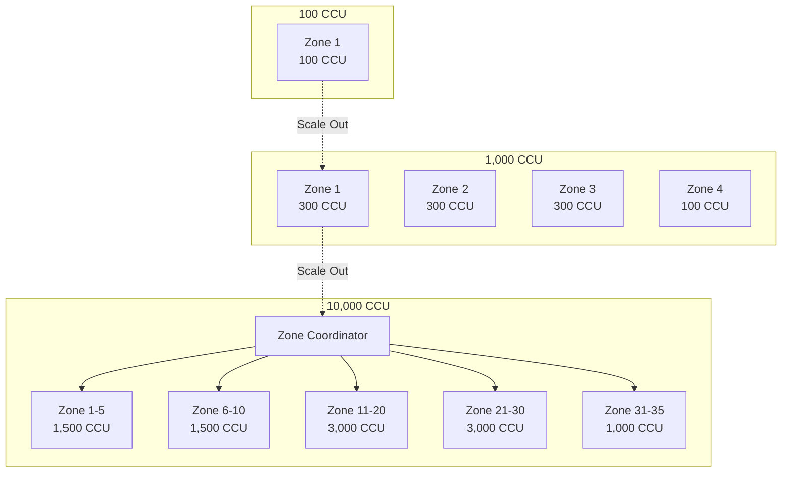

### B2B 비즈니스 모델 확장

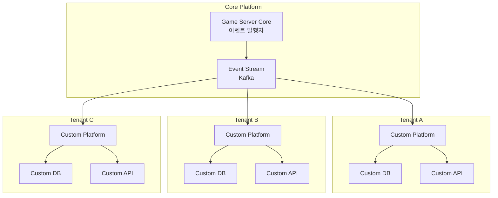

---

## 상태 머신 (플레이어 생명주기)

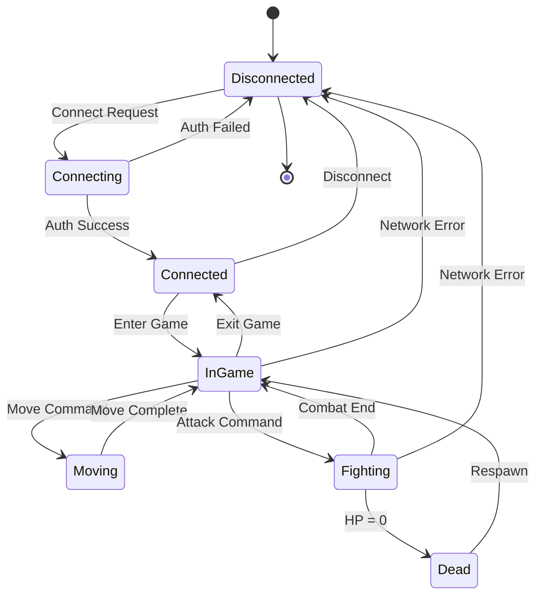

---

[← 메인으로 돌아가기](../README.md)